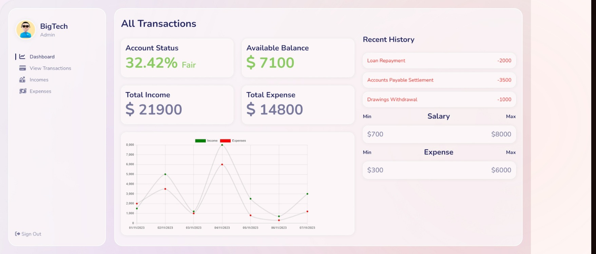

# Financial Health Tracker Tool

## Table of Contents

- [Overview](#overview)
  - [Screenshot](#home-page-preview)
  - [Links](#links)
- [How to run](#how-to-run)
- [My process](#my-process)
  - [Built with](#built-with)
  - [Features](#features)

---

## Overview

Welcome to a financial health indicator tool. This is a tool to track the financial health of a company. This tool is built using `react`, `typescript`, `vite` and `styled-components`. I have used `axios` for API calls, `chart.js` and `react-chartjs-2` for the chart, `moment` for date formatting and `react-datepicker` for date picker.

## Links

- Live Site Link: [Click Here](https://financial-health-indicator.vercel.app/) to see the Live website.
- Client side Github Repo: [Click Here](https://github.com/kamrulsaad/finance-health-indicator-frontend) to check my client side github repo for this project.
- Server side Github Repo: [Click Here](https://github.com/kamrulsaad/finance-health-indicator-backend) to check my server side github repo for this project.

## Home Page Preview

---

## How to run

- Clone the project (both client and server side) from the github repo.
- Run `yarn install` to install all the dependencies.
- Run `yarn run dev` to run the project.
- If you want to connect it to the local backend server, then you need to change the BASE_URL in the `src/context/global.tsx` file to `http://localhost:5000/api/v1/`.

## My Process

Basically, this project was built as per the requirements provided. This project was initiated with the fact that a beautiful user interface will be designed with a modern and scalable backend system. As we can see in this project, a beautiful modern UI has been implemented. The backend or the server is very much scalable, but they are many opportunities to improve.provided enough time I could have implemented much more features then what it is having now.

Based on the requirements, a user can see the status of their business account. They can add or remove different transaction histories and also view them. Analyzing the data provided by the user, in the dashboard, the financial health status will be shown. Although automated or manual testing was not performed in the building of this project. However, since I have used typescript I can be sure that a project of this size will have comparatively fewer issues than what it could have if javascript was used.

## Future Improvements

I have tried to implement the project as per the requirements. However, there are many opportunities to improve this project. Some of them are listed below:

- Automated testing can be implemented.
- More features can be added to the dashboard.
- More features can be added to the transaction history page.
- Features like user profile page can be added.
- Features like user authentication can be added, and many more.

## Built With

- `react`, `vite`, `typescript` - Framework & Language
- `axios` - For API calls
- `chart.js`, `react-chartjs-2` - For the chart
- `moment` - For date formatting
- `react-datepicker` - For date picker
- `styled-components` - For styles

---

## Features

Users should be able to:

- See a Beautiful, animated and responsive landing page
- See dynaminc data for their financial health status
- By clicking on the income or expense tab on the left sidebar, they can add or remove transaction history
- On the dashboard users can visualize their financial health status by seeing the chart
- Current Balance, Min/Max expense and income will be shown in the dashboard

---

Please check the [backend repository](https://github.com/kamrulsaad/finance-health-indicator-backend) for more details about the backend of this project.
